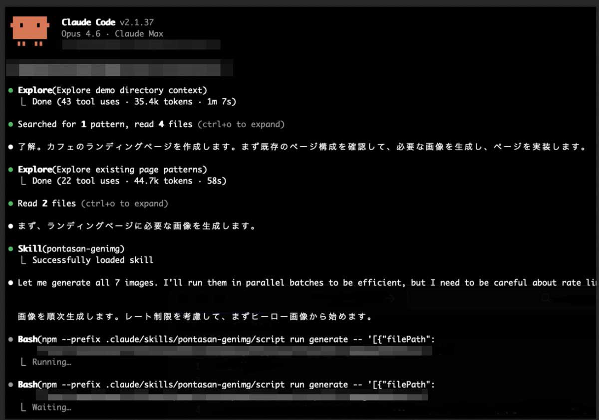
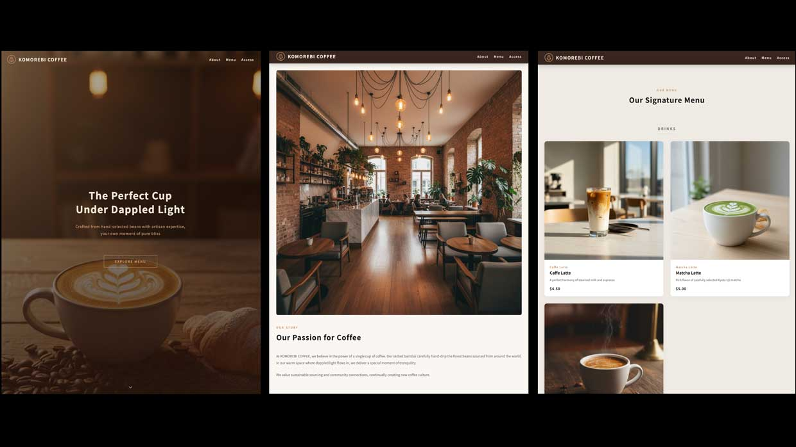

# pontasan-skills

A collection of custom skills for Claude Code.

## Demo

Here's an example of Claude Code automatically generating images while building a cafe landing page.



The finished website built with the generated images:



## Skills

### pontasan-genimg

An AI image generation skill powered by the Google Gemini API. Automatically generates image assets (icons, illustrations, backgrounds, logos, banners, etc.) needed during frontend development.

#### Features

- Generates images using Google Gemini API
- Supports both binary images (PNG, JPEG, WebP) and vector graphics (SVG)
- Two generation modes: **fast** (default) and **quality** (use when high quality is truly needed)
- Automatically respects API rate limits (RPM / TPM / RPD)

#### Requirements

- Node.js (developed on v24, but likely works on other versions)

#### Setup

1. Get a [Google Gemini API key](https://aistudio.google.com/apikey)
2. Set the `GEMINI_API_KEY` environment variable
3. Install dependencies:

```bash
cd skills/pontasan-genimg/script
npm install
```

## License

ISC
